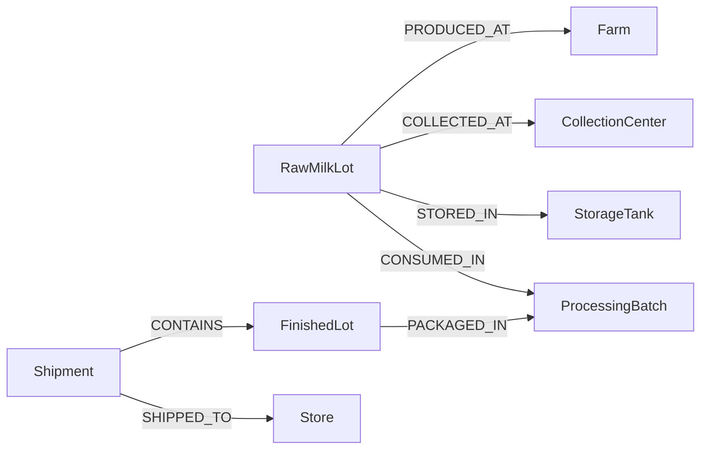
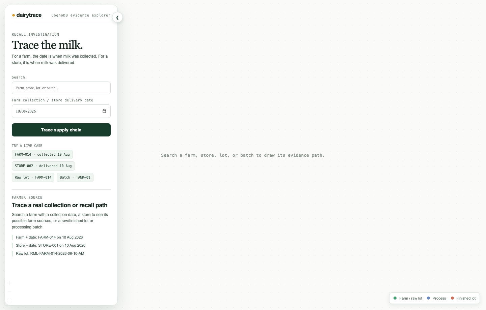
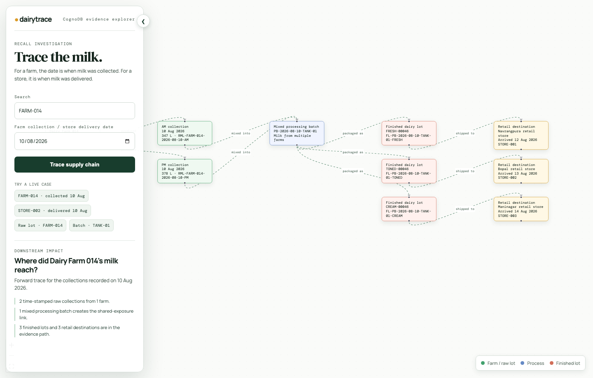
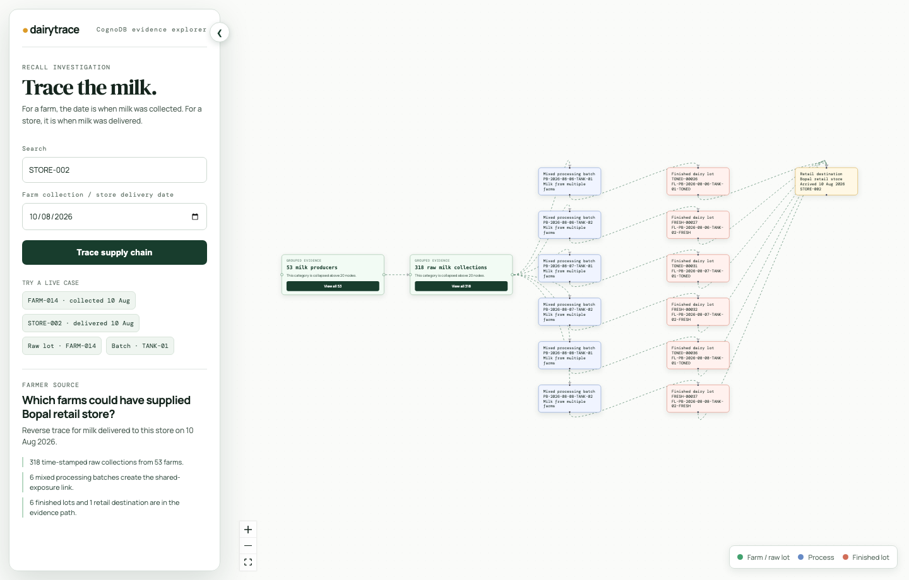

# Dairy Recall Impact Explorer

A fictional Amul-style recall investigation tool built with React, Fastify, and CognoDB. It helps a quality team trace milk forward from a farm collection or backward from a store delivery.

Graph links show **candidate impact evidence**, not proof of contamination or fault.

## Why CognoDB

Milk from several farms is mixed into a processing batch, then split into finished lots and store deliveries. This many-to-many lineage is naturally queried as graph paths.



## Setup

Requirements: Node.js 18+, pnpm, and a CognoDB instance with Bolt access.

```bash
pnpm install
cp .env.example .env
```

Configure `.env` with the values from your CognoDB connection panel:

```dotenv
COGNODB_URI=bolt+s://your-instance.databases.cognodb.cloud
COGNODB_USERNAME=cognodb
COGNODB_PASSWORD=your-password
```

The application expects existing graph data in the configured instance. It deliberately has no seed or wipe commands.

## Run

```bash
pnpm dev
```

Open [http://localhost:5173](http://localhost:5173). The API health check is [http://localhost:3001/api/health](http://localhost:3001/api/health).

## Test and build

```bash
pnpm test
pnpm check
pnpm build
```

`pnpm test` runs 26 Vitest tests across the API and frontend. API tests use Fastify request injection and mocked CognoDB access; frontend tests use jsdom and React Testing Library.

## Main traces

| Search | Result |
| --- | --- |
| Farm + collection date | Raw collections, batches, finished lots, and reachable stores. |
| Store + delivery date | Delivered lots traced back to possible farm collections. |
| Raw lot | Direct forward recall impact. |
| Finished lot | Reverse source trace. |
| Processing batch | Farms and stores connected by that mixing point. |

All Cypher is static and parameterised in [apps/api/src/app.ts](apps/api/src/app.ts). Farm dates filter collections; store dates filter shipment arrival dates.

## Project layout

```text
apps/api/                 Fastify routes and CognoDB adapter
apps/web/src/app/         application composition
apps/web/src/features/    trace API, graph model, state, and UI
docs/screenshots/         README UI screenshots
```

## Screenshots and demo







[Watch the Loom walkthrough](https://www.loom.com/share/480271b2ba0c404d954ef928f37b436d)
